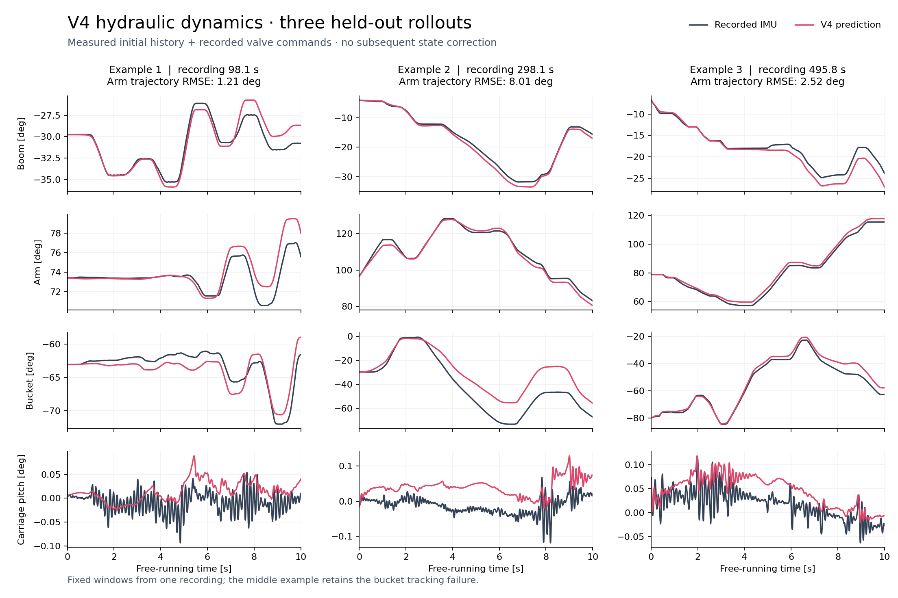

# Learned hydraulic actuators for Isaac Lab

A small excavator demo driven by learned hydraulic dynamics: **V4 for boom, arm,
bucket and carriage pitch**, plus an independent **slew MLP**. Both predict velocity
increments at 100 Hz; the simulator integrates the resulting velocities into joint
positions.

Idea from Egli, P. and Hutter, M. (2020) 'Towards RL-Based Hydraulic Excavator Automation'. Great paper!

## Run the demo

Tested with **Isaac Lab 3.0 / Isaac Sim 6.0.1**. Clone this repository into
`IsaacLab/scripts/Isaac-hydraulic-actuator`, activate your Isaac environment, and
run this command **from the Isaac Lab root**:

```bat
isaaclab.bat -p scripts/isaac-hydraulic-actuator/sim.py --model scripts\Isaac-hydraulic-actuator\models\arm_v4 --slew-model scripts\Isaac-hydraulic-actuator\models\slew
```

In PowerShell, prefix the launcher with `.\isaaclab.bat`. Model arguments are
**directories**, relative to the working directory. V4 and slew are also the
defaults, so the shorter command works too:

```powershell
.\isaaclab.bat -p scripts\Isaac-hydraulic-actuator\sim.py
```

The Kit window opens in NN mode. Connect an Xbox-compatible controller:

| Control | Action |
| --- | --- |
| Right stick Y | Boom valve |
| Left stick Y | Arm valve |
| Right stick X | Bucket/tool valve |
| Left stick X | Slew valve |
| A | Toggle learned hydraulics / manual joint velocities |
| B | Reset to the starting pose |

The sticks have a 30% dead zone. Add `--tool gripper` for the other included
asset; the additional gripper joints remain at their default pose. Without a
controller, valve commands remain zero. A short headless check is:

```powershell
.\isaaclab.bat -p scripts\Isaac-hydraulic-actuator\sim.py --viz none --max_steps 300
```

## Example rollouts



Three fixed 10-second windows from the new held-out recording. Each rollout uses
measured initial history and recorded valve commands, then feeds back its own
predictions with **no later measured-state correction**. These are offline neural
rollouts; Isaac's direct integration was checked against the same calculation.
The middle window deliberately retains a substantial bucket tracking error.

## Included models

| Model directory | Motion outputs | Hidden layers | Parameters |
| --- | --- | --- | ---: |
| `models/arm_v4` | Boom, arm, bucket, carriage pitch | 512 / 512 / 384, ReLU | 579,972 |
| `models/slew` | Slew | 32 / 32, tanh | 2,145 |


| Held-out endpoint MAE | 10 seconds | 30 seconds |
| --- | ---: | ---: |
| V4 arm, new IMUs | 3.49° | 6.78° |
| V4 arm, older IMUs corrected offline | 3.71° | 6.17° |
| Slew | 9.23° | 21.11° |

Arm errors average the three hydraulic joint endpoints across disjoint windows;
pitch is excluded from that metric. Each arm row uses one held-out recording.
Slew uses a separate recording containing partial turns, so full-turn hardware
accuracy is still unmeasured. These errors are relative to IMU measurements,
not external ground truth. Bucket drift and imperfect pitch oscillations remain.

Each model directory contains its weights, normalization arrays, channel/architecture
metadata, and a release manifest with SHA-256 hashes. No dataset download or
training step is needed to run the demo.

## How integration works

At each 0.01 s step, the network predicts a velocity increment:

```text
velocity_next = velocity + model(position, velocity_history, valve_history)
position_next = position + 0.01 * velocity_next
```

V4 selects `direct` integration automatically. The learned joints are written
directly into simulation; their physical drives and carriage springs are disabled
so they do not fight the predicted motion. This demo models free motion and does
not provide a validated contact or digging-force response. Arm limits still apply,
and a held valve at an end stop cannot induce a learned rebound.

The assets include the tested target-drive gains: arm 2400 N·m/rad and
120 N·m·s/rad; slew 600 N·m/rad and 40 N·m·s/rad. The alternative `target`
integration route remains available for compatible three-joint models; V4 requires
`direct`.

For direct Python use, only NumPy and PyTorch are needed. From the Isaac Lab root:

```python
import sys
import numpy as np

sys.path.insert(0, "scripts/Isaac-hydraulic-actuator")
from actuators import HydraulicActuatorNet

model = HydraulicActuatorNet("scripts/Isaac-hydraulic-actuator/models/arm_v4", sim_dt=0.01)
model.reset()
q = np.array([-0.5498, 1.2549, -0.7540, 0.0], dtype=np.float32)  # rad: boom, arm, bucket, pitch
v = np.zeros(4, dtype=np.float32)                              # rad/s
u = np.array([0.2, 0.0, 0.0], dtype=np.float32)                # valves: boom, arm, bucket
for _ in range(100):
    v = model.predict_velocity(q, v, u)
    q = q + model.dt * v
```

This minimal loop starts with zero command/velocity history and omits the demo's
joint-limit handling. Slew uses another `HydraulicActuatorNet` instance with
one position, one velocity and one valve channel.

## Repository layout

- `sim.py`, `sim_common.py`, `endstop_guard.py`: excavator demo and joint configuration.
- `actuators/`: reusable MLP inference and direct/target integration.
- `assets/`: self-contained bucket/gripper USDs; V4 selects the pitch-capable `_rocking` variants.
- `models/`: the selected V4 and slew releases only.
- `training/`: reusable CSV/LeRobot training, evaluation, and regression checks.
- `media/`: the README rollout figure.

The generic trainer is a baseline training tool, not the
complete V4 fine-tuning recipe. To inspect its options or check the release:

```powershell
.\isaaclab.bat -p scripts\Isaac-hydraulic-actuator\training\train.py --help
.\isaaclab.bat -p scripts\Isaac-hydraulic-actuator\training\eval.py --help
.\isaaclab.bat -p -m pytest scripts\Isaac-hydraulic-actuator\training -q
```

Development formatting and checks use `pre-commit run --all-files` from this
repository's root. License: [BSD-3-Clause](LICENSE).
