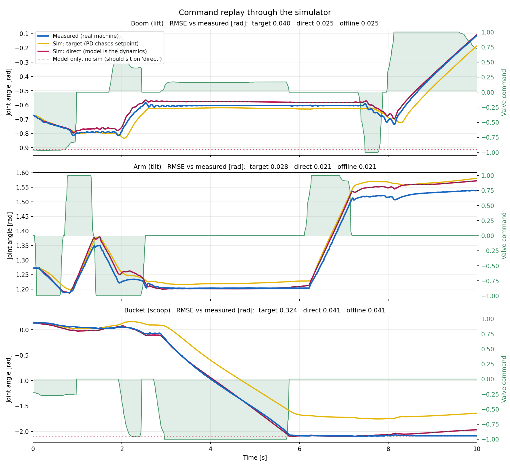

# Isaac Hydraulic Actuator

This is a data-driven forward model for the three hydraulic arm joints (boom, arm, bucket) of an excavator, hooked up as a demo to Isaac Lab with gamepad teleop.

The idea is pretty straightforward: train a small MLP on real drive logs to predict what joint velocity a given valve command will actually produce. Feed that predicted velocity into the sim either via PhysX joint control or directly, and the sim starts behaving like the real machine, hydraulic lag and all that goodness. Joint positions are just integrated forward each step from the predicted velocity.

Thanks to Egli & Hutter (IROS 2020). Their paper on RL-based hydraulic excavator automation is what gave me the idea for this approach.

An excavator boom / arm / bucket is included as a worked example, with a trained
model you can run immediately. Current model is pretty good except the initial jerks with large commands. This is the datasets fault, not the models (excvacator hull moved, its fixed in the sim!).



Ten seconds of recorded valve commands replayed through the sim. Blue is the real
machine, crimson is `direct` (model drives the joints), yellow is `target` (PhysX
PD chasing the model's setpoint). The dashed line is the model on its own with no
sim at all, and it lands right on top of crimson, which is how you know the sim
loop isn't adding anything of its own.

## How it works

At 100 Hz one MLP receives current joint position, 0.1 s of joint-velocity
history and 0.99 s of valve-command history, and predicts the velocity change:

```text
delta_qdot = qdot(t + 0.01) - qdot(t)
qdot_next  = qdot(t) + delta_qdot
q_next     = q(t) + dt * qdot_next
```

Position is integrated outside the network. One network models all three joints
together so it can learn the coupling between them. On a real machine the axes
share a pump, and moving two at once slows both.

## Quick start

Requires Isaac Lab. From your Isaac Lab installation:

```bash
isaaclab.bat -p /path/to/Isaac-hydraulic-actuator/sim.py --model /path/to/Isaac-hydraulic-actuator/model
```

Gamepad: right stick Y lifts the boom, left stick Y the arm, right stick X the
bucket, left stick X slews the cabin. `A` toggles between the learned model and
direct velocity control, `B` resets.

## The two integration routes

`--integration`
selects which actuator drives the joints, and they are genuinely different
physics:

**`direct`** — [`DirectIntegrationActuator`](actuators/direct_integration_actuator.py).
The learned velocity is integrated into joint state and written straight to the
simulator. The model *is* the dynamics; PhysX does not get a say. Use it when you
want the learned hydraulics to be ground truth. These joints will not react to
contact.

**`target`** — [`VelocityIntegratedActuator`](actuators/velocity_integrated_actuator.py).
The same velocity is integrated into a *position target* and the articulation's
PD drive chases it. Contact and load response are preserved (but not tested, can be awful), at the cost of a
second dynamic system the real machine does not have, with its own lag.

> **If you use `direct`, you must zero the drive gains for those joints.**

## Training on your own machine
It's pretty easy to convert this to accept basically any kind of dataset, I had multiple 10min runs available.
The training environment needs `pandas` and `pyarrow` in addition to NumPy and PyTorch.

```bash
python -m pip install pandas pyarrow
```

```bash
python train.py --data /path/to/your/logs --out runs/my_run --device cuda
```

Parquet columns, one row per 100 Hz sample:

| column | unit |
|---|---|
| `timestamp` | seconds |
| `joint_pos_boom`, `joint_pos_arm`, `joint_pos_bucket` | rad |
| `joint_vel_boom`, `joint_vel_arm`, `joint_vel_bucket` | rad/s |
| `combined_cmd_lift`, `combined_cmd_tilt`, `combined_cmd_scoop` | normalized [-1, 1] |

Timestamp discontinuities and non-finite sensor rows split trajectories automatically.
Legacy CSV input remains supported through the `--csv` alias.

Rename columns to match your data or edit the constants
at the top of [`dataset.py`](dataset.py).

### Checkpoint selection is on rollout error, not validation loss

At 100 Hz `qdot(t+dt) ≈ qdot(t)`, so a network can score well on one-step MSE by
leaning on its own past velocity, then drift the moment it eats its own
predictions. On this data the two genuinely pull against each other: over one
training run, the checkpoint with the best one-step R2 was 21% worse on
free-running position error than the one rollout selection picked.

So every `--rollout-every` epochs, [`rollout.py`](rollout.py) free-runs
trajectories inside the held-out recordings and scores mean absolute position
error across the full trajectory. `mlp_state_dict.pt` is the best of those, not
the last epoch; final weights are kept as `mlp_state_dict_final.pt`. `--select-on val`
restores one-step selection, mainly so you can reproduce that comparison
yourself.

### Splitting

`--split session` holds out whole driving sessions. Recordings are grouped by
wall-clock continuity rather than filename because one drive may span consecutive
files; filename grouping could place parts of the same drive on both sides.

`--split snippet` holds out contiguous snippets from every drive instead, with a
leakage buffer. Every session then contributes to training, which measured
stronger on a held-out benchmark here at the cost of a validation set that is not
independent at the session level.

`--split-seed` is separate from `--seed` so a weight-init sweep does not silently
re-split the data and refit the normalizers.

## Evaluating

```bash
python eval.py --model runs/my_run --data "held_out/*.parquet"
```
Reports one-step R2, free-running velocity, trajectory/final position error at
several horizons, and drift at rest. Multiple files are pooled and summarized
duration-weighted. Use trajectory position MAE as the primary number; endpoint
error and rest drift catch complementary failures.

## Testing

```bash
python test_contract.py --model model
```

[`actuators/hydraulic_actuator.py`](actuators/hydraulic_actuator.py) deliberately
does **not** import `dataset.py`. It is an independent second implementation of
the same feature layout, written against ring buffers for real-time single-step
inference. That independence is what gives the parity test something real to
check — if it shared the feature builder, the test would only prove numpy equals
numpy. Run it after touching the feature layout, the metadata keys, or the
architecture.

## Porting to your own robot

Honest about what this costs today:

- **Three joints is hardcoded** (`N_JOINTS = 3` in `dataset.py`, and again in
  `actuators/hydraulic_actuator.py`). A machine with a different count needs both
  edited.
- **`sim.py` is an example, not a template.** Joint names, the scene, the fixed
  base, and the gamepad mapping are all specific to this excavator. The reusable
  part is `actuators/`.
- **Joint order is `[boom, arm, bucket]`** everywhere, and the actuators resolve
  joints with `preserve_order=True` because a silent permutation would scramble
  the model.
- **Control rate must match the model's `dt`.** History taps assume samples are
  `dt` apart, so running at a different rate stretches every horizon by that
  ratio. `HydraulicActuatorNet` raises rather than let this pass silently.

## The included model

Trained on ~90 minutes of logged excavator driving. Default configuration, best
checkpoint at epoch 1470 of 1800. Its metadata reports the previous endpoint-only
5 s rollout error of 0.032 rad over held-out sessions; retraining uses the stronger
full-trajectory MAE described above.

| | |
|---|---|
| inputs | 138 — 3 positions, 11×3 velocity taps, 34×3 command taps |
| hidden | 3 × 128, ReLU |
| target | `delta_velocity` |
| rate | 100 Hz |

Not modelled: cabin slew (control it separately), oil temperature, engine RPM,
and **end stops**. Joint limits are enforced by the simulator. Pretty easy to update to match your robot though.

The current dataset wasn't the best possible as I was just testing the idea, so the model can still be improved a lot.

## Credits

The learned-forward-model approach, predicting a velocity delta from position,
velocity history and command history, then integrating outside the network, and
treating that integration as the joint dynamics, follows the hydraulic
excavator work of **Egli and Hutter** (Robotic Systems Lab, ETH Zürich).
This repository is an **independent implementation** written from the published
method. It is not affiliated with, derived from, or endorsed by those authors,
and it contains none of their code. Any errors here are mine.

Trained on data recorded from instrumented excavator at Savonia
University of Applied Sciences.
Also thanks Claude for the help.

## License

Apache License 2.0, see [LICENSE](LICENSE). You may use, modify and
redistribute this commercially, including in closed-source work, with no
obligation to contribute changes back.

The included model weights and `assets/excavator.usd` are released under the
same terms.
