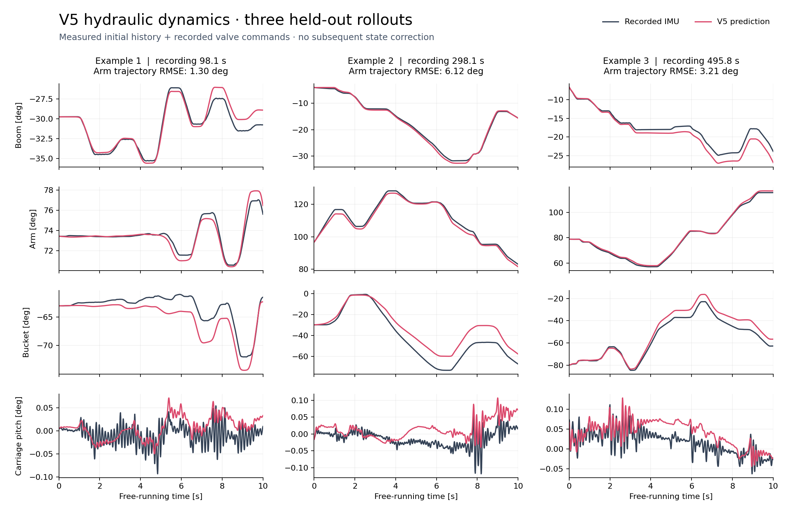

# Learned hydraulic actuators for Isaac Lab

A small excavator demo driven by learned hydraulic dynamics: **V5 for boom, arm,
bucket and carriage pitch**, plus an independent **slew MLP**. Both predict velocity
increments at 100 Hz; the simulator integrates the resulting velocities into joint
positions.

Idea from Egli, P. and Hutter, M. (2020) 'Towards RL-Based Hydraulic Excavator Automation'. Great paper!

## Run the demo

Tested with **Isaac Lab 3.0 / Isaac Sim 6.0.1**. Clone this repository into
`IsaacLab/scripts/Isaac-hydraulic-actuator`, activate your Isaac environment, and
run this command **from the Isaac Lab root**:

```bat
isaaclab.bat -p scripts/isaac-hydraulic-actuator/sim.py --model scripts\Isaac-hydraulic-actuator\models\arm_v5 --slew-model scripts\Isaac-hydraulic-actuator\models\slew
```

The Kit window opens in NN mode. Connect an Xbox-compatible controller:

| Control | Action |
| --- | --- |
| Right stick Y | Boom valve |
| Left stick Y | Arm valve |
| Right stick X | Bucket/tool valve |
| Left stick X | Slew valve |
| A | Toggle learned hydraulics / manual joint velocities |
| B | Reset to the starting pose |

## Train the end-effector controller

Step two of the Egli & Hutter recipe: a PPO policy receives a desired bucket-tip
twist `(X, Z, bucket pitch rate)` and outputs the three valve commands directly.
The frozen V5 steady actuator network is the plant, so training runs as batched
Torch on the GPU with no simulator (~75k steps/s with 4096 environments; a
1,500-iteration run takes about half an hour). From the Isaac Lab root:

```powershell
.\isaaclab.bat -p scripts\Isaac-hydraulic-actuator\train_controller.py --run_name my_run
```

Design choices, and the measurement behind each:

- **Carriage rocking is not tracked.** The tracked twist comes from the boom,
  arm and bucket joints only. Rocking cannot be driven by the valves, and the
  learned pitch channel rings far longer than the real carriage when started
  outside the recorded ±0.3° pitch range. Resets therefore start at pitch ≈ 0.
- **Valve chatter costs reward.** An L1 + L2 penalty on valve change per policy
  step keeps commands in the range seen in the recordings. Otherwise the policy
  learns to dither around the deadband and runs the actuator model far outside
  its data.
- **Commands match the data.** Recorded tip speeds are mostly 30–150 mm/s, and
  the valves barely move the arm below |u| ≈ 0.2–0.3. Commands span 10–120 mm/s,
  are held 1–3 s and slew at 0.25 m/s². A governor keeps them away from joint
  limits and self-collision (a cached lookup grid).
- **Hidden plant perturbations.** Each episode draws a valve gain (±10 %),
  offset (±0.02) and a 0–20 ms transport delay, plus observation noise. The
  critic sees them; the policy does not. Pass `--no_randomize` for a
  deterministic baseline.
- **Position loop outside the policy.** Draw and circle modes command
  `v_ref + kp·(x_ref − x)` with `kp = 3`, as in the RA-L paper.

### Run the draw demo

The prototype controller ships in `models/controller_proto` and is the default,
so these commands work on a fresh clone without training. They need RSL-RL,
which `isaaclab.bat --install` includes. From the Isaac Lab root:

```powershell
.\isaaclab.bat -p scripts\Isaac-hydraulic-actuator\run_controller.py --mode draw
.\isaaclab.bat -p scripts\Isaac-hydraulic-actuator\run_controller.py --mode circle --speed-mm-s 40
.\isaaclab.bat -p scripts\Isaac-hydraulic-actuator\run_controller.py --mode gamepad --speed-mm-s 60
```

Playback cruises at 30 mm/s unless `--speed-mm-s` is given. Pass
`--checkpoint path\to\model_N.pt` to run your own training run instead; the
console reports the benchmark's recommended speed when a benchmark matches the
checkpoint.

The benchmark runs held commands with reversals and stops, plus quintic-timed
circles and lines, under nominal and perturbed valves. Results go to CSV/JSON
and a figure under `runs/`:

```powershell
.\isaaclab.bat -p scripts\Isaac-hydraulic-actuator\run_controller.py --mode benchmark --viz none
```

Draw mode holds the starting bucket angle, so only part of the drawing box is
reachable. The window shades the rest dark and turns a stroke red when it enters
that area. A rejected stroke keeps its reason on screen and in the console. Draw
and circle modes also show the planned path and the executed trace in the 3D
viewport.

Gamepad mode maps the left stick to tip X/Z velocity, right stick X to bucket
pitch rate, and B to reset. Everything here is free-space motion in simulation;
digging, contact and the real machine are not validated.

## Tune the robot's joint PID

The same plant can tune the classic controller on the real machine: the
boom/arm/bucket PIDs of [kaivuriprokkis](https://github.com/eetmie/kaivuriprokkis)
(`modules/pid.py`, ported 1:1 to batched Torch). All three tools read the gains
from a sibling `kaivuriprokkis` checkout (`--robot_repo`) and need no simulator:

```powershell
.\isaaclab.bat -p scripts\Isaac-hydraulic-actuator\measure_speeds.py   # what the plant can reach at all
.\isaaclab.bat -p scripts\Isaac-hydraulic-actuator\replay_pid.py       # the robot's current gains
.\isaaclab.bat -p scripts\Isaac-hydraulic-actuator\tune_pid.py         # CMA-ES, writes a pid: YAML block
```

- `measure_speeds.py` maps the achievable tip speed per direction across the
  workspace, with deadband and flow sharing between joints. That is the ceiling
  for any controller.
- The replay runs the robot's own loop (DLS IK step, then PID, then valves) over
  joint steps, ramps and tip lines under the benchmark's valve perturbations.
  Lines the plant cannot follow are flagged rather than blamed on the gains.
- The tuner scores only those feasible lines, from HOME and three central poses,
  with measured IMU jitter, and mixes the mean with the worst plant. It writes
  before/after replays next to the tuned gains.


## Example rollouts



Three fixed 10-second windows from the new held-out recording. Each rollout uses
measured initial history and recorded valve commands, then feeds back its own
predictions with **no later measured-state correction**. These are offline neural
rollouts; Isaac's direct integration was checked against the same calculation.
The middle window deliberately retains a substantial bucket tracking error.

Note that I'm using hobby grade, uncalibrated ISM330 IMU's. Industry grade 3D systems (Leica, Novatron, and such) will prob lead to _much_ better results.

## Included models

| Model directory | Motion outputs | Hidden layers | Parameters |
| --- | --- | --- | ---: |
| `models/arm_v5` | Boom, arm, bucket, carriage pitch | 512 / 512 / 384, ReLU | 579,972 |
| `models/arm_v4` | Boom, arm, bucket, carriage pitch | 512 / 512 / 384, ReLU | 579,972 |
| `models/slew` | Slew | 32 / 32, tanh | 2,145 |


| Held-out endpoint MAE | 10 seconds | 30 seconds |
| --- | ---: | ---: |
| V5 arm, new IMUs | 2.73° | 5.27° |
| V5 arm, older IMUs corrected offline | 3.11° | 5.70° |
| V4 arm, new IMUs | 3.49° | 6.78° |
| V4 arm, older IMUs corrected offline | 3.71° | 6.17° |
| Slew (gyro only, tiny dataset!) | 9.23° | 21.11° |

Arm errors average the three hydraulic joint endpoints across disjoint windows;
pitch is excluded from that metric. Each arm row uses one held-out recording.
Slew uses a separate recording containing partial turns, so full-turn hardware
accuracy is still unmeasured. These errors are relative to IMU measurements,
not external ground truth. Bucket drift and imperfect pitch oscillations remain.

Each model directory contains its weights, normalization arrays, channel/architecture
metadata, and a release manifest with SHA-256 hashes. No dataset download or
training step is needed to run the demo.

## How integration works

At each 0.01 s step, the network predicts a velocity increment:

```text
velocity_next = velocity + model(position, velocity_history, valve_history)
position_next = position + 0.01 * velocity_next
```

V4 and V5 select `direct` integration automatically. The learned joints are written
directly into simulation; their physical drives and carriage springs are disabled
so they do not fight the predicted motion. This demo models free motion and does
not provide a validated contact or digging-force response. Arm limits still apply,
and a held valve at an end stop cannot induce a learned rebound.

The assets include the tested target-drive gains: arm 2400 N·m/rad and
120 N·m·s/rad; slew 600 N·m/rad and 40 N·m·s/rad. The alternative `target`
integration route remains available for compatible three-joint models; V4 and V5 require
`direct`.

For direct Python use, only NumPy and PyTorch are needed. From the Isaac Lab root:

```python
import sys
import numpy as np

sys.path.insert(0, "scripts/Isaac-hydraulic-actuator")
from actuators import HydraulicActuatorNet

model = HydraulicActuatorNet("scripts/Isaac-hydraulic-actuator/models/arm_v5", sim_dt=0.01)
model.reset()
q = np.array([-0.5498, 1.2549, -0.7540, 0.0], dtype=np.float32)  # rad: boom, arm, bucket, pitch
v = np.zeros(4, dtype=np.float32)                              # rad/s
u = np.array([0.2, 0.0, 0.0], dtype=np.float32)                # valves: boom, arm, bucket
for _ in range(100):
    v = model.predict_velocity(q, v, u)
    q = q + model.dt * v
```

This minimal loop starts with zero command/velocity history and omits the demo's
joint-limit handling. Slew uses another `HydraulicActuatorNet` instance with
one position, one velocity and one valve channel.

## Repository layout

For the gyro-history controller, USD-matched bucket deployment profile, fixed-tip
rotation results and Jetson shadow/robot instructions, see
[the hardware transfer guide](docs/gyro_transfer.md). Simulation acceptance is
complete; physical robot acceptance is still pending.

- `sim.py`, `sim_common.py`, `endstop_guard.py`: excavator demo and joint configuration.
- `actuators/`: reusable MLP inference and direct/target integration.
- `hydraulic_controller/`, `train_controller.py`, `run_controller.py`: learned valve controller training, benchmark and playback.
- `measure_speeds.py`, `replay_pid.py`, `tune_pid.py`: robot PID replay and tuning. `hydraulic_controller/tasks.py` and `closed_loop.py` hold the controller-neutral scenarios and loop; `pid.py`, `pid_tuning.py` and `speed_limits.py` the PID side.
- `assets/`: self-contained bucket/gripper USDs; V4 and V5 select the pitch-capable `_rocking` variants.
- `models/`: the selected V4, V5 and slew releases, plus `arm_v5_steady`, the controller's plant, and `controller_proto`, the prototype controller.
- `training/`: reusable CSV/LeRobot training, evaluation, and regression checks.
- `media/`: the README rollout figure.

The generic trainer is a baseline training tool, not the
complete V4/V5 fine-tuning recipe. To inspect its options or check the release:

```powershell
.\isaaclab.bat -p scripts\Isaac-hydraulic-actuator\training\train.py --help
.\isaaclab.bat -p scripts\Isaac-hydraulic-actuator\training\eval.py --help
.\isaaclab.bat -p -m pytest scripts\Isaac-hydraulic-actuator\training -q
```

Development formatting and checks use `pre-commit run --all-files` from this
repository's root. License: [BSD-3-Clause](LICENSE).
